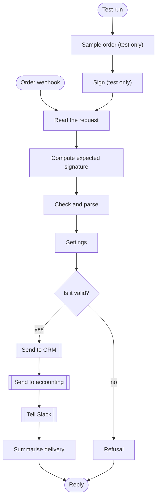

# n8n Workflows

Three n8n workflows for work that businesses automate again and again, each tested for real: the success paths and the failure paths. You can import them into n8n and use them, or read them to see how I build automations.

| Workflow | What it does |
|---|---|
| **Lead intake and scoring** | A webhook receives a lead, scores it from 0 to 100 with the reasons written out, and sends a strong lead to the CRM and the sales team. Everything else goes to a nurture list. A lead with no email is never marked hot. |
| **Signed order webhook, checked and sent on** | Checks that an order really came from your shop (signature and timestamp), checks that the total adds up, then sends it to a CRM, an accounting system and Slack, retrying when a system is down. Anything that fails a check is refused with a clear reason and nothing is sent. |
| **Daily sales digest** | Every morning it fetches yesterday's orders, leaves out the cancelled ones, and posts a short summary to Slack. On a quiet day it says so. |

The CRM, accounting, Slack and spreadsheet in these workflows are stand ins that run on your computer (`mock/server.js`), so nothing needs an account to try them.

## What the order workflow does



The workflow has two ways in. The **Order webhook** is the real one. **Test run** feeds the same steps with a signed sample order so the workflow can be run from the command line.

## How it was tested

`npm test` runs 21 checks against the mock services and compares what each system received:

- **11 headless runs** with n8n's own command line (`n8n execute`): a strong lead, a vague lead, a strong lead with no email, a valid order, a flaky CRM, an accounting system that refuses an order, a wrong signature, a stale timestamp, a wrong total, a normal sales digest and an empty one.
- **10 live runs.** n8n is started for real, the workflows are published, and signed HTTP requests are sent to their webhook URLs. This covers what the headless runs cannot: reading the raw request body and headers, and replying to the caller.

Running it for real found two bugs that I fixed: a Set node that dropped the incoming fields, and a webhook that rejected valid signed orders because it re-formatted the body before checking the signature. The signature covers the exact bytes that were sent, so the workflow now reads those bytes. A test sends a pretty printed body to make sure this stays true.

## Use it

Needs Node 20 or later. Installing n8n takes a few minutes.

```bash
npm install
npm test                 # about 3 minutes
node scripts/build.js    # rebuilds the workflow files in workflows/
node scripts/mermaid.js  # redraws docs/diagrams.md from them
```

To use a workflow in your own n8n: choose Import from file and pick a file in `workflows/`. Then open the **Settings** node and change `base_url` to your own system, and swap the generic HTTP Request nodes for the real nodes and credentials of your CRM, accounting tool and Slack.

## Honest limitations

- **Only the mock services have been used.** No real CRM, accounting tool, Slack or spreadsheet was connected. The HTTP Request nodes would normally be replaced by n8n's dedicated nodes with their own credentials.
- **I have not opened these in n8n's web editor.** They were imported and run from the command line and over HTTP. They should look normal in the editor, but I have not checked.
- **The demo signing secret is written into the workflow** (`demo-secret-change-me`), which is only acceptable for a demo. Use an n8n credential or environment variable for a real secret.
- **The signature comparison is not constant time.** It is a plain string comparison in a Code node. That matters little for a webhook behind a rate limit, but a service that must resist timing attacks should do this check somewhere that can compare in constant time.
- **n8n's built in retry retries every failure, including a 4xx refusal.** The accounting test shows it trying three times before moving on. My Python integration hub stops at once on a 4xx instead.
- **The lead webhook has no signature check.** Anyone who knows the URL can send it a lead. Add a check like the order workflow has before using it on a public form.
- **n8n answers a malformed JSON body itself, before the workflow runs.** In the version tested (2.22.6) that reply includes a stack trace with file paths. Put the webhook behind a proxy or gateway that hides it.
- **The daily schedule has not been left to fire.** The digest is tested through its manual entry, which runs the same steps.
- **The scoring rules are copied from my Lead Qualification Agent** and are a starting point, not a recommendation for your business.
