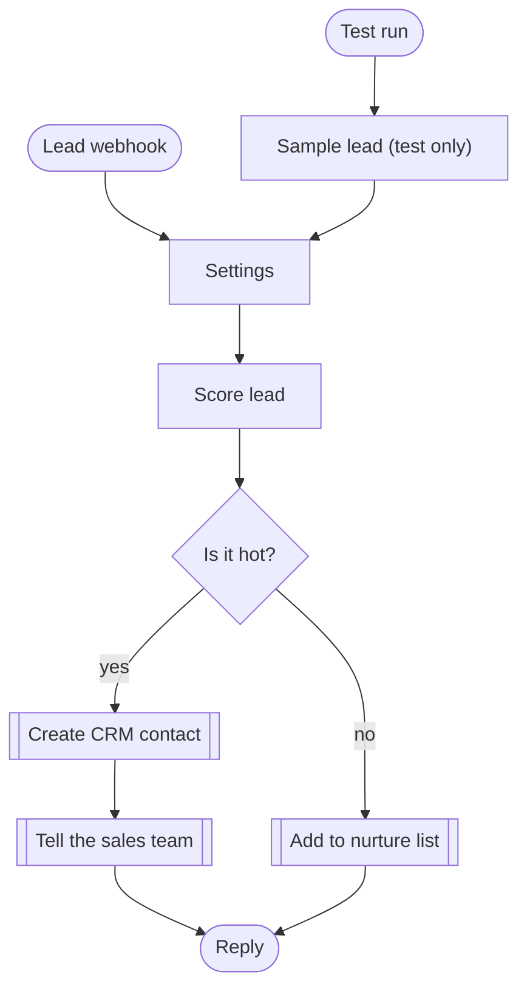
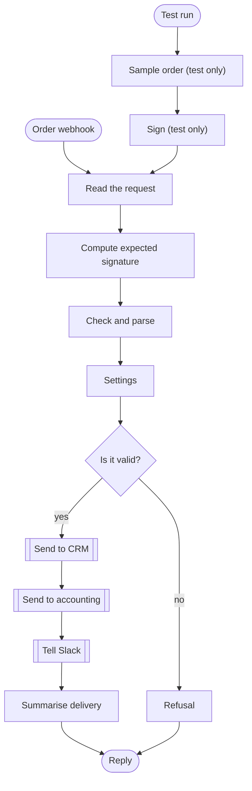
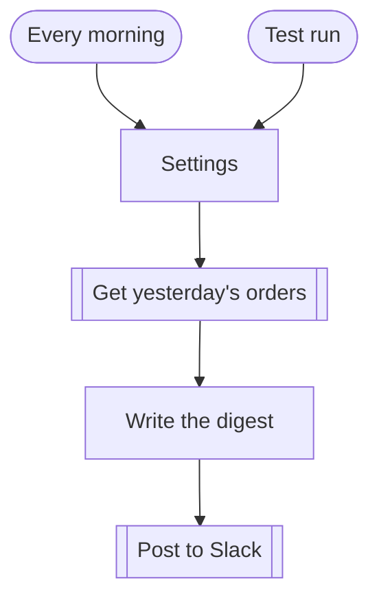

# Workflow diagrams

Generated from the files in `workflows/` by `node scripts/mermaid.js`. Rounded boxes start or end a run, diamonds are decisions, double edged boxes call another system.

## Lead intake and scoring

## Signed order webhook, checked and sent on

## Daily sales digest

